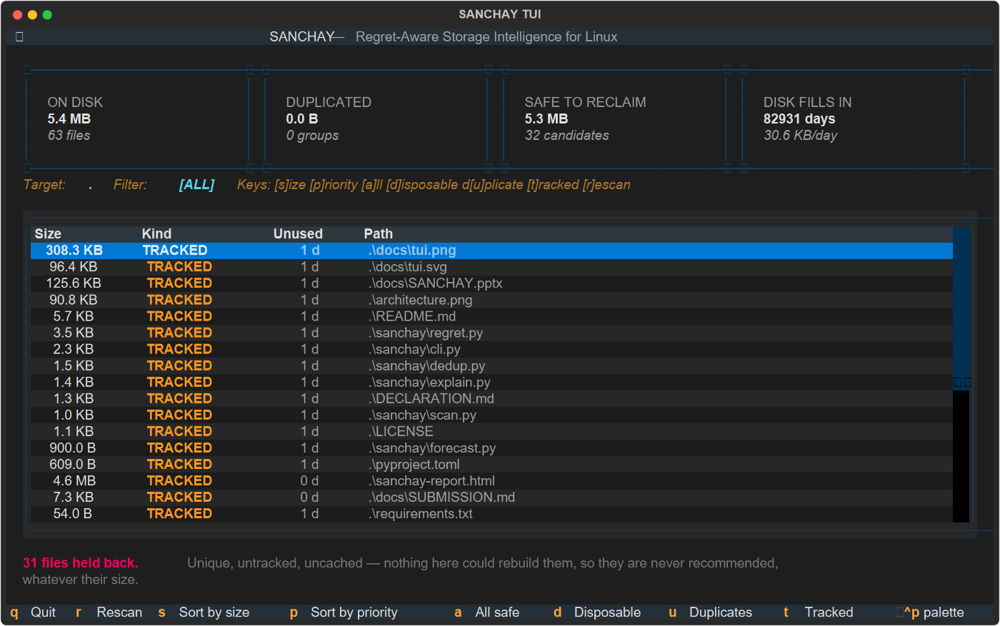

# SANCHAY

[](https://github.com/basithladdu/sanchay/actions)
[](https://opensource.org/licenses/MIT)
[](https://www.python.org/)
[](https://github.com/basithladdu/sanchay)
[](https://www.meity.gov.in/)

Tells you what's safe to delete on your Linux machine — and shuts up about everything that isn't.

Built for the C-DAC / MeitY AI Enabled Operating System Hackathon 2026.
Track: AI at Application Level.
Problem: *AI-Powered Intelligent Storage Optimizer for Linux OS*.

## Why we built it

Every disk cleaner sorts your files by size. Biggest first. That's the wrong
question.

Say you've got a 2 GB build cache and a 2 GB folder with the only copy of your
final year project. Both are 2 GB. Both show up the same shade of big on a
treemap. But one comes back if you run `npm install`, and the other is gone
forever.

Sorting by size treats those as the same problem. They are not the same problem.

So we sort by a different question: **if we're wrong about this, how bad is it?**

## How it decides

For every file we ask — if this disappears, can you get it back?

| Where it lives | Get it back? | We call it |
|---|---|---|
| build cache, `node_modules`, `__pycache__`, `.venv` | yeah, one command | `disposable` |
| there's an identical copy elsewhere on disk | yeah, the copy survives | `duplicate` |
| committed inside a git repo | mostly, yeah | `tracked` |
| none of the above | **no** | `unique` |

Anything that lands in `unique` we never suggest deleting. Doesn't matter if
it's 40 GB. Doesn't matter if you haven't opened it in three years. We just
don't bring it up.

Everything else gets ranked by:

```
how big  ×  how long since you touched it  ×  how safe it is to lose
```

That's the whole idea. It's not clever, it's just the right question.

## Guessing when you'll run out of space

Normally you'd need to track disk usage over weeks to predict this. You don't.

Every file already knows the day it was written. So one scan of the disk gives
you the whole history for free — how many bytes a day you've been adding.
Compare that to your free space and you get a date.

```
growth:     91.2MB/day, full in 137 days
```

## The picture

Everyone draws the same treemap. Ours is coloured by whether the file is safe to
delete, not by how big it is:

- **green** — build junk, delete it, nothing happens
- **yellow-green** — there's another copy
- **yellow** — it's in a repo
- **red** — irreplaceable, leave it alone

So you can look at your disk and immediately see where the free money is.

```bash
python -m sanchay.cli ~/ --viz storage.html
```

## Install

```bash
git clone https://github.com/basithladdu/sanchay
cd sanchay
pip install -e .            # core, no dependencies at all
pip install -e ".[all]"     # plus the treemap and the AI summary
```

The core runs on the standard library alone. `plotly` and `pandas` only load if
you ask for a treemap, `anthropic` only if you ask for a summary.

## The interface

It's a terminal app, built on [Textual](https://github.com/Textualize/textual).
A disk tool belongs in the terminal — that's where the disks are, and it's the
only thing that works over ssh on a box with no desktop. `ncdu` got that right.

```bash
sanchay-ui ~/
```



Rows are color-coded by whether you can get the file back.

### Interactive TUI Controls
* `d` → Filter to **Disposable** build/cache files
* `u` → Filter to **Duplicate** content groups
* `t` → Filter to **Tracked Git** repositories
* `a` → Show **All Safe Candidates**
* `s` → Sort by **File Size**
* `p` → Sort by **Regret Priority**
* `r` → **Rescan** filesystem
* `q` → **Quit**

## Try it

```bash
sanchay ~/                               # scan and rank
python -m sanchay.cli ~/                 # scan and rank
python -m sanchay.cli ~/ --viz out.html  # add the treemap
python -m sanchay.cli ~/ --explain       # have Claude write it up
sanchay ~/ --report sanchay-report.html  # shareable interactive HTML report
```

Looks like this:

```
48,213 files, 61.4GB

duplicates: 214 groups, 3.1GB reclaimable
growth:     91.2MB/day, full in 137 days
candidates: 20 safe, 9,847 irreplaceable files excluded

      size  kind          unused  path
------------------------------------------------------------------------------
    73.5MB  disposable      5.8d  ~/proj/.next/cache/webpack/server-production/0.pack
    39.1MB  disposable      5.8d  ~/proj/.next/cache/webpack/client-production/0.pack
```

That "9,847 irreplaceable files excluded" line is the point. Those are the files
a normal cleaner would have happily offered up.

## About the AI bit

Claude writes the summary at the end. It does **not** pick what to delete — the
ranking is already done before it sees anything, and it only gets the list of
files we already decided are safe.

We did it that way on purpose. If the model picks, then one bad answer means
someone loses a file. If the model only narrates, the worst it can do is
describe things awkwardly.

## Making it fast

Hashing every file on a big disk takes forever, so we don't. Group by size
first, then hash the first 64 KB of anything that collides, then fully hash only
what still collides after that. Most files never get read at all.

Hardlinks pointing at the same inode aren't counted as duplicates, since they're
already sharing the same bytes — deleting one frees nothing.

## What you need

Python 3.9+. That's basically it — the core runs on the standard library.
`plotly` and `pandas` for the treemap, `ANTHROPIC_API_KEY` only if you want the
written summary.

## What we used vs what we wrote

Ours: the scanner, the duplicate finder, the regret model, the forecaster.

Borrowed:

| Thing | Licence | What for |
|---|---|---|
| plotly | MIT | the treemap |
| pandas | BSD-3 | shaping data for the treemap |
| anthropic | MIT | writing the summary |

## Data

No outside dataset. It reads your own filesystem — paths, sizes, timestamps —
and only opens files to confirm duplicates. Nothing leaves your machine unless
you pass `--explain`, and even then it only sends the list of paths.

## Licence

MIT. See [LICENSE](LICENSE).
